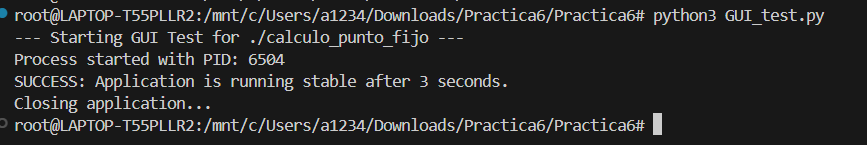

# Informe de verificación - Práctica 6

## Ejercicio 6.2: verificación y validación del ejercicio 2.10

**Puesto y grupo:** P01 g02

**Nombre de los integrantes:** Luis Valls Antón / Marcos Cantero Garcia / Ismael Mustafa Mouadeb

**Fecha de entrega:** 23/01/2026

---

## a) Estrategia de verificación

### Tipo de testeo utilizado

Se han adoptado distintas estrategias de pruebas en función de la capa del sistema a implementar. En concreto: 

  - Para la capa 3 (base) hemos realizado una estrategia de **Caja Negra (Black Box Testing)**.
  - Mientras que para la capa 1 (GUI) hemos realizado una estrategia de **Caja Blanca (White Box Testing)**.

Todas las pruebas se han llevado a cabo siguiendo una estrategia incremental de tipo bottom-up, en la que el proceso de verificación comienza por los módulos situados en los niveles inferiores de la jerarquía del sistema. 

**Justificación:**
1. **Caja negra (black-box):**
Las pruebas se diseñan y ejecutan a partir de la especificación funcional del sistema, verificando que para un conjunto determinado de entradas la salida obtenida es la esperada. Este enfoque no considera la implementación interna, sino únicamente su comportamiento observable, lo que permite validar el cumplimiento de los requisitos sin introducir dependencias con la estructura interna del diseño.

2. **Caja blanca (white-box):**
Las pruebas se plantean con conocimiento de la implementación interna, permitiendo verificar no solo la corrección de las salidas, sino también la ejecución adecuada de los distintos caminos, operaciones y condiciones internas. Este tipo de test facilita detectar errores, problemas de cobertura y posibles casos no contemplados, asegurando que todas las partes relevantes del código han sido ejercitadas conforme a la especificación.

3. **Estrategia bottom-up:**
La estrategia de testeo bottom-up consiste en verificar inicialmente los módulos de menor nivel de forma aislada, utilizando drivers para simular su entorno. Una vez validados, estos módulos se emplean en los testeos subsiguientes. Este enfoque permite detectar errores de manera temprana en los componentes básicos y asegurar que cada bloque cumple su funcionalidad antes de formar parte del sistema completo.

### Técnicas de diseño de casos de test

- **Particionado por equivalencias:**
  Esta técnica de tipo `caja negra` nos permite dividir los datos de entrada en grupos válidos e inválidos, se asume que todos los valores dentro de una misma partición se comportan igual, permitiendo probar solo únicamente un valor.
  En el script `generacion.py`, los casos de prueba generados seguían esta idea, pero tras llevar a cabo test exhaustivos con muchas cantidades de datos generados aleatoriamente (pero en un rango en el que deberían funcionar bien) se detectaron algunos errores inesperados. Por tanto, para validar realmente el funcionamiento de nuestra implementación de los calculos en punto fijo se llevan a cabo algunos casos de particionado por equivalencias pero también se generan multitud de test de valores aleatorios dentro de un rango. Las entradas se han dividido en distintas clases con el fin de explorar la mayor cantidad de valores posibles y obtener una buena cobertura. Hemos definido:
  - **Valores habituales:** Valores de entrada que se encuentran dentro de los rangos establecidos por los datahseets de cada uno de los sensores (enlace a datasheets en las Referencias de la memoria). Por ejemplo: en el caso de los moles valores comprendidos entre 0.2 < Vp < 4.7 y 0 < Vt < 1.5 
  - **Valores aleatorios (wide):** Casos de test aleatorios comprendidos extrictamente en el rango de valores definido en el primer apartado, comprobamos que algunos casos no cumplen los tests por la combinación de valores generada.
  - **Valores aleatorios (narrow):** Casos de test aleatorios comprendidos un rango de valores más limitado que el definido en el primer apartado, comprobamos que todos los casos cumplen los tests.

- **Valores frontera:** Para complementar la técnica de particionado por equivalencias se prueban los valores máximos y mínimos de cada caso y también, los valores que están inmediatamente por encima o por debajo de los rangos establicidos en el apartado anterior. Por ejemplo: en el caso de los moles sería emplear valores como Vp = 0.2 y Vt = 1.5 en el caso de los máximos y mínimos o Vp = 0.19 y Vt = 1.6 para los valores fuera de los límites.

- **Casos especiales:** Valores que no se darán de forma habitual y que, por tanto, debemos forzar nosotros con el fin de ser explorados y conocer el comportamiento de nuestro diseño (la mayoría de casos darán error pero son casos que debemos comprobar). Por ejmplo: +- infinito, NaN, overflow, MAX_FLOAT.

- **Formato tests generados** Cuando se generan los .txt con los casos de test se sigue el siguiente formato:

  - **Entrada_1 | Entrada_2 | Salida | Tipo_test**

  Nota 1: `tipo_test` nos indica si los valores de las entradas que vamos a introducir son valores normales, aleatorios (narrow/wide), límites o casos especiales.

  Nota 2: hemos tomado una tolerancia del 6% para todos los casos y por eso no se especifica el criterio de aceptación en los casos de test (puesto que todos tienen el mismo).

- **Otras técnicas (Tests a nivel de sistema):**
  - **Prueba de arranque:** Implementado en `test_GUI_basic.py`. Verifica simplemente que la aplicación es capaz de arrancar, mantenerse en ejecución durante unos segundos y cerrarse sin errores.
  - **Test de interacción automático:** Implementado en `test_GUI_dogtail.py`. Se trata de un test con mayor profundidad que el anterior. Simula un usuario real interactuando con la ventana mediante teclado y ratón.

---

## b) Descripción de los tests implementados

NOTA: si se quiere llevar a cabo alguna comprobación, se debe tener en cuenta de que en todo momento se trabaja desde el mismo directorio que el makefile. Tratar de realizar comprobaciones o llamadas desde otro directorio causará que no funcionen como deberían o como se espera.

### Tests de la capa base (cálculos en punto fijo)

*Ejemplos de casos de test:*
| Test | Entrada | Salida esperada | Tolerancia |
|------|---------|-----------------|------------|
| Moles Max | Vp=4.7, Vt=1500.0 | 0.497432 | 6% |
| Densidad Frontera | P=49999, Vt=1751.0 | Error | 6% |
| Energía Overflow | Overflow | Error | N/A |
| Moles rand | Vp=1, Vt=200.0 | 0.127648 | 6% |

*Descripción de los tests:*

Tal y como se ha comentado anteriormente, la estrategia que hemos elegido para llevar a cabo la verificación es una combinación de partciones por equivalencia, valores límites, casos especiales y una gran cantidad de valores aleatorios (un bucle que generan cientos de casos de test en un rango más amplio y otro bucle que los genera en un rango más estrcho) para poder llevar a cabo un estudio detallado. Todos estos casos se generan automáticamente mediante el script `generacion.py` y se almacenan en ficheros de texto en el directorio `data`como `x_test_cases.txt`. Posteriormente se comprueba si los resultados obtenidos son correctos realizando el `pytest`, de esta tarea se encarga el script `test_puntofijo.py`. Haciendo uso de esta herramienta hemos podido comprobar: 

  - Si nuestra implementación de las operaciones en punto fijo es coorecta (obtenemos valores que se encuentran dentro del margen de error establecido, el cual es del 6%).
  - Si efectivamente se rechazan los valores fuera de rango y los casos especiales oportunos. 
  - Si se puede mejorar nuestra implementación.

Referente al desarrollo del script `test_puntofijo.py` destacar que en un primer momento realizamos un código que empleaba la funcionalidad `fixtures` de pytest (marcar a las funciones como fuentes de datos) para llevar a cabo la verificación pero, nos encontramos con las problemática de que cada vez que detectaba un error dejaba de ejecutar los tests y de los cientos o miles que tenía que probar solo hacía unos cuantos (hasta que llegase a alguno de los casos donde nosotros forzamos el error). Por tanto, probamos algunas alternativas y finalmente realizamos la implementación mediante `mark.parametrizable` también de pytest y esta sí que nos permitió evaluar todos nuestros casos de test.

### Tests de la capa intermedia (funciones de interfaz)
La capa intermedia (`gestion.c`) se ha creado con el objetivo de mejorar la estructura de la práctica 2.10. En esta capa se han integrado los callbacks de las funciones llamadas desde los elementos de la interfaz. Esta capa no ha podido ser verificada de forma directa e independiente. El motivo de esto es su fuerte dependencia de la librería de GTK a pesar de la reestructuración, que hace imposible generar funciones independientes a los widgets de GTK. 
- La generación de los ficheros se realiza de forma progresiva desde una ventana emergente diferente a la interfaz principal y también presenta botones y campos para rellenar.
- El test automático también lanza una ventana emergente que selecciona un fichero para pasárselo a las funciones de test automático de puntofijo.c.

Por esto mismo, dichas funciones no han podido ser probadas de forma independiente a la interfaz. No obstante, no han dejado de ser verificadas, ya que se ha invertido más dedicación en realizar un test de integración completo, en el que se verifica el correcto funcionamiento de estas funciones.

*Descripción de los tests:*
La capa intermedia se verifica implícitamente a través de los tests de integración. Se valida que los datos introducidos en la GUI se convierten correctamente y se pasan a la capa base. Se verifica también la correcta generación de los ficheros de las funciones correspondientes.

### Tests de integración / GUI
Como se ha comentado en la documentación proporcionada para la práctica, los tests de GUI resultan más complejos de implementar. Inicialmente se ha implementado un test básico pero posteriormente, ante la falta de un test para la capa intermedia, se ha decidido profundizar en la verificación de la interfaz.

*Descripción de los tests:*
Se han desarrollado dos scripts complementarios para asegurar la robustez de la GUI:

1.  **Test básico (`test_GUI_basic.py`):**
    Este programa de Python utiliza la librería `subprocess` para lanza el ejecutable `./calculo_punto_fijo` en segundo plano, espera 3 segundos para asegurar que la inicialización de GTK es correcta y verifica que el proceso sigue vivo. Finalmente, cierra la aplicación de forma controlada. Esto permite asegurar que la interfaz es estable.

2.  **Test avanzado(`test_GUI_dogtail.py`):**
    Este programa realiza un test de la interfaz más exhaustivo que el anterior. Simula la interacción de un usuario con la interfaz, que pulsa botones, introduce datos en las entry y navega para seleccionar ficheros para los tests. Además de la librería `subprocess`, también emplea la librería `dogtail`, que permite explorar los distintos elementos de una ventana (la interfaz y sus 'hijos') y simular la interacción con ellos. 
    
    También se ha empleado la herramienta `Accerciser` para explorar los nodos de la interfaz y saber las características por las cuales los podía encontrar dogtail (nombre y descripción, principalmente) y las acciones que se podía realizar con ellos.

    Se han implementado tres tipos de test: 
    - Verificación de las funciones de tests específicos, que toman como datos de entrada los generados para la capa 3 y los introduce en las entrys correspondientes un número determinado de veces.
    - Verificación de las funciones de test automáticos, que navegan automáticamente por el explorador de archivos y seleccionan los ficheros de ejemplo generados para la práctica 2.10.
    - Verificación de las funciones de generación de ficheros, que navegan dentro de la ventana emergente, introducen datos para generar el archivo, lo guardan y cierran. Finalmente se verifica que ha sido creado correctamente.

---

## c) Resultados de la verificación

A continuación, se presentan los resultados de la verificación:

### Capturas de pantalla de la ejecución de tests

**Verificación de la capa 3**

En primer lugar, se analizó la cobertura de código del script `puntofijo.c`, para ello se hizo uso de las herramientas `gcov` y `lcov` (esta la usaremos ya que nos permite generar reports en html más gráficos,como el que se muestra a continuación) y el resultado ha sido el siguiente:

Tal y como se puede apreciar obtenemos una cobertura de código del 100% (todas las lineas y funciones se ejecuutan), este report está disponible en el directorio `reports/coverage_report/c/puntofijo.c.func.html`. Y si queremos ver cuántas veces se ha ejecutado cada línea del código, se ha generado también un archivo `puntofijo.c.gcov`en `reports`.

Una vez comprobada la cobertura de código pasamos a analizar la funcional mediante el uso del script `test_puntofijo`(dentro de este se ha hecho una llamada a las funciones de calculo_x para calcular el error respecto a la tolerancia, con el fin de poder sacar un report más simple y luego al pytest para sacar el report más detallado). En primer lugar, se sacan por el terminal todos los casos que se van a probar:

Una vez se presentan todos los casos de text sale un report simple que nos informa de los casos totales, los exitosos, los fallidos, el porcentaje de éxito y también una lista de los casos que han fallado:

Una vez termina este report se llama a pytest y se realiza la comprobación más detallada:

Como se puede comprobar la mayoría de los casos pasan los test y pero hay casos que no, algunos debido a que son valores se encuentran fuera de los límites descritos, otros porque son casos especiales (que realmente no deben pasar los test) y otros que sí deberían pasarlos pero que no los pasan por imprecisiones en el desarrollo de `puntofijo.c` o de los rangos de las entradas de `moles, densidad y energía cinética`.

**(Captura de pantalla de la ejecución: `./GUI_test_bash.sh`)**

**(Captura de pantalla de la ejecución: `./test_GUI_basic.py`)**

Como se observa en las capturas, la verificación de la interfaz gráfica se ha realizado mediante una estrategia de *Caja Blanca*. Esta metodología permite comprobar de forma directa el funcionamiento interno de la aplicación, evaluando tanto la respuesta a las acciones del usuario (como clics y navegación) como el comportamiento general de la interfaz.
El script `GUI_test_bash.sh` valida la interacción básica con los elementos gráficos, mientras que el archivo `test_GUI_basic.py` en Python se encarga de abrir la interfaz y detectar posibles errores o fallos durante su inicialización.

### Resumen de resultados

| Capa | Tests ejecutados | Tests pasados | Tests fallidos |
|------|------------------|---------------|----------------|
| Base (Moles) | 615 casos | 604 | 11 |
| Base (Densidad)| 618 casos | 560 | 58 |
| Base (Energía) | 618 casos | 603 | 15 |
| GUI/Integración | 2 scripts (Py + Sh) | 2 | 0 |

### Análisis de errores (si los hay)

Tal y como se puede apreciar aunque nuestra implementación es correcta para la mayoría de casos de test que se prueban, esta no se encuentra libre de fallos y principalmente en los cálculos de densidad presenta más errores que en el resto de casos. Algunos de los errores han sido introducidos a mano para probar casos los especiales y valores fuera de rango, pero otros no deberían darse pues son valores aleatorios que en principio deberían ser válidos (se encuentran dentro del rango). A la hora de crear los rangos de valores de las entradas hemos puesto los valores que hemos consultado en los datasheet pero los resultados nos hacen pensar que estos deben ser ajustados un poco. Por otro lado, también podríamos volver a revisar los rangos y los bits empleados en las operaciones realizadas en puntofijo.c y ver si se pueden mejorar los resultados.  

---

## d) Conclusiones

Finalmente, concluiremos este informe destacando los siguientes aspectos:

### En cuanto a la cobertura alcanzada

`Cobertura de código:`

- Hemos explorado herramientas que nos permiten estudiarla como son -gcov o -lcov.

- Hemos alcanzado una cobertura del 100% (en puntofijo.c).

`Cobertura funcional:`

- Se ha verificado cada capa independientemente en distintos escenarios y un gran cantidad de casos de test.
- Se han empleado scripts y herramientas específicas (pytest y asserts).

### Lecciones aprendidas

1. Es imprescindible tener una buena y clara estructuracion del proyeto tanto a nivel de codigo fuente y como a nivel de directorios.
2. Hemos conseguido afianzar nuestros conocimientos sobre los sistema de control de versiones (git y github) para un mejor trabajo en equipo de forma paralela.
3. Hemos aprendido la forma de realizar scripts de pruebas automatizadas para poder llevar a cabo test de forma más rápida y escalable.

### Mejoras propuestas

1.  Implementar **CI/CD con GitHub Actions**: Configurar un pipeline que ejecute estos tests automáticamente en cada `push` al repositorio.
2.  Aumentar la granularidad de los tests unitarios para `gestion.c` separando la lógica de validación de la lógica de GTK para poder testearla sin levantar la interfaz gráfica.

---

## Referencias

1. Apuntes de la asignatura: Tema 7 - Validación y Verificación.
2. Documentación oficial de Pytest: https://docs.pytest.org/
3. Preguntas varias: https://stackoverflow.com/questions
4. Myers, G. J. (2012). The Art of Software Testing.
5. Datasheet del MPX5700AP: https://www.nxp.com/docs/en/data-sheet/MPX5700.pdf
6. Datasheet del LM35: https://www.ti.com/lit/ds/symlink/lm35.pdf?ts=1769101168972&ref_url=https%253A%252F%252Fwww.ti.com%252Fproduct%252FLM35
7. Datasheet del BMP280: https://www.bosch-sensortec.com/media/boschsensortec/downloads/datasheets/bst-bmp280-ds001.pdf
8. Datasheet del TMP36: https://www.analog.com/media/en/technical-documentation/data-sheets/tmp35_36_37.pdf
9. Datasheet del ADXL345: https://www.analog.com/media/en/technical-documentation/data-sheets/adxl345.pdf
10. Datasheet del HX711: https://cdn.sparkfun.com/datasheets/Sensors/ForceFlex/hx711_english.pdf

11. Elección de pytest.mark.parametrizable sobre pytest.fixtures: https://stackoverflow.com/questions/60369047/pytest-using-parametized-fixture-vs-pytest-mark-parametrize

---
